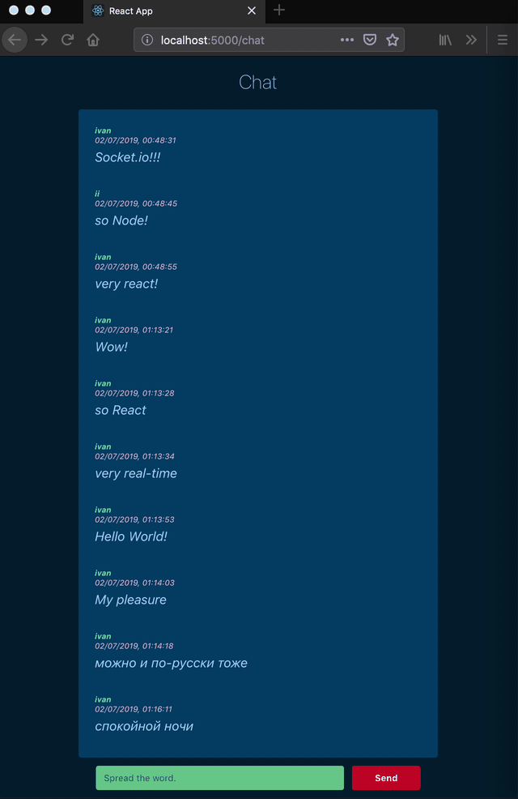

## Demo chat backend RESTful API

### Node.js + Socket.io
---
usage:

1. `python db_init.py`: initialize sqlite database  
2. `npm install`: install packages  
3. `node app.js`.

The feed will get populated with the latest 10 available messages.

